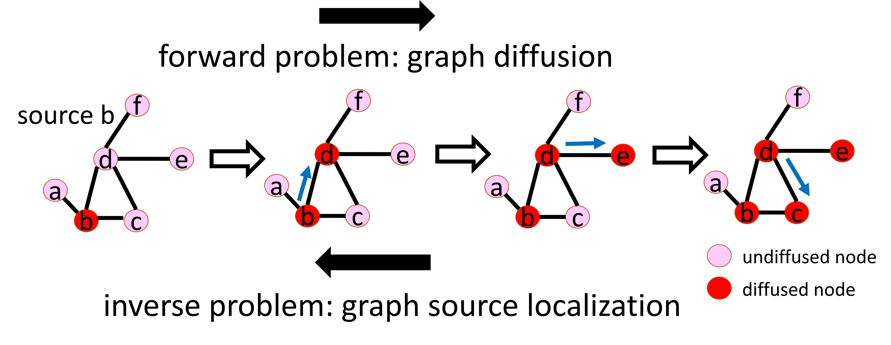
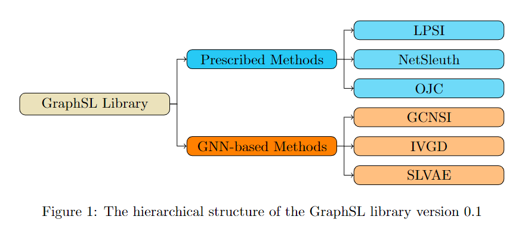

[](https://graphsl.readthedocs.io/en/latest/?badge=latest)
[](https://lbesson.mit-license.org/)
[](https://badge.fury.io/py/graphsl)
[](https://pepy.tech/project/graphsl)


# GraphSL: Graph Source Localization Library

This is the source code of the GraphSL (Graph Source Localization) library, in order to support the research and development of the graph learning community.

# Introduction

## Problem Definition



Graph diffusion is a fundamental task in graph learning, which aims to predict future graph cascade patterns given source nodes. Conversely, its inverse problem, graph source localization, though rarely explored, stands as an extremely important topic: it focuses on the detection of source nodes given their future graph cascade patterns. As illustrated in the above figure, graph diffusion seeks to predict the cascade pattern $\lbrace b,c,d,e \rbrace$ from a source node $b$, whereas graph source localization aims to identify source nodes $b$ from the cascade pattern $\lbrace b,c,d,e \rbrace$. 

Graph source localization spans a broad spectrum of promising research and real-world applications. For instance, online social media platforms like Twitter and Facebook have been instrumental in disseminating rumors and misinformation with significant repercussions. Additionally, the rapid propagation of computer viruses across the Internet, infecting millions of computers, underscores the critical need for tracking their sources. Moreover, in smart grids, where isolated failures can trigger rolling blackouts leading to substantial financial losses, graph source localization plays a pivotal role. Hence, the graph source localization problem demands attention and extensive investigations from machine learning researchers.

The GraphSL library includes six state-of-the-art approaches and eight benchmark datasets.


## Approaches



 Existing graph source localization methods can be categorized into two groups: Prescribed methods and Graph Neural Networks (GNN)-based methods.

Prescribed methods rely on hand-crafted rules and heuristics. For instance, LPSI propagates infection in networks and labels local peaks as source nodes. NetSleuth employed the Minimum Description Length principle to identify the optimal set of source nodes and virus propagation ripple. OJC identified a set of nodes (Jordan cover) that cover all observed infected nodes with the minimum radius.

GNN-based methods learn rules from graph data in an end-to-end manner by capturing graph topology and neighboring information. For example, GCNSI utilized LPSI to enhance input and then applied Graph Convolutional Networks (GCN) for source identification; IVGD introduced a graph residual scenario to make existing graph diffusion models invertible, and it devises a new set of validity-aware layers to project inferred sources to feasible regions. SLVAE used forward diffusion estimation and deep generative models to approximate source distribution, leveraging prior knowledge for generalization under arbitrary diffusion patterns.

## Benchmark Datasets

|       Dataset      |  #Node |  #Edge |
|:------------------:|:------:|:------:|
|       Karate       |   34   |   78   |
|      Dolphins      |   62   |   159  |
|         Jazz       |   198  |  2,742 |
| Network   Science  |  1,589 |  2,742 |
|       Cora-ML      |  2,810 |  7,981 |
|    Power   Grid    |  4,941 |  6,594 |


Aside from methods, we also provide six benchmark datasets to facilitate the research of the graph source localization problem. All datasets are introduced as follows:

1. Karate: Karate depicts the social ties among members of a university karate club.

2. Dolphins: Dolphins represents a social network of bottlenose dolphins, with edges indicating frequent associations between dolphins.

3. Jazz: Jazz illustrates a collaboration network among Jazz musicians, where edges signify instances of playing together in a band.

4. Network Science: Network Science portrays a coauthorship network of scientists engaged in network theory and experimentation, with each edge representing co-authorship of a paper.

5. Cora-ML: Cora-ML is a portal network of computer science research papers obtained through machine learning techniques.

6. Power Grid: Power Grid delineates the topology network of the Western States Power Grid in the United States.

# Installation

First, install GraphSL using pip:


    pip install GraphSL

Or, clone the [repo](https://github.com/xianggebenben/GraphSL) and install requirements:

    pip install -r requirements.txt

Second, download the data folder of the [repo](https://github.com/xianggebenben/GraphSL), which contains six datasets.


# Quickstart

Now, you can import and use GraphSL in your Python code. Please make sure your Python code and the data folder are in the same directory:

``` python

from GraphSL.GNN.SLVAE.main import SLVAE
from GraphSL.GNN.IVGD.main import IVGD
from GraphSL.GNN.GCNSI.main import GCNSI
from GraphSL.Prescribed import LPSI, NetSleuth, OJC
from GraphSL.utils import load_dataset, diffusion_generation, split_dataset
import os
curr_dir = os.getcwd()
# 'karate', 'dolphins', 'jazz', 'netscience', 'cora_ml', 'power_grid'
data_name = 'karate'
graph = load_dataset(data_name, data_dir=curr_dir)
dataset = diffusion_generation(graph=graph, infect_prob=0.3, diff_type='IC', sim_num=100, seed_ratio=0.2)
adj, train_dataset, test_dataset = split_dataset(dataset)
lpsi = LPSI()
alpha, thres, auc, f1, pred = lpsi.train(adj, train_dataset)
print("LPSI:")
print(f"train auc: {auc:.3f}, train f1: {f1:.3f}")
metric = lpsi.test(adj, test_dataset, alpha, thres)
print(f"test acc: {metric.acc:.3f}, test pr: {metric.pr:.3f}, test re: {metric.re:.3f}, test f1: {metric.f1:.3f}, test auc: {metric.auc:.3f}")
netSleuth = NetSleuth()
k, auc, f1 = netSleuth.train(adj, train_dataset)
print("NetSleuth:")
print(f"train auc: {auc:.3f}, train f1: {f1:.3f}")
metric = netSleuth.test(adj, test_dataset, k)
print(f"test acc: {metric.acc:.3f}, test pr: {metric.pr:.3f}, test re: {metric.re:.3f}, test f1: {metric.f1:.3f}, test auc: {metric.auc:.3f}")
print("OJC:")
ojc = OJC()
Y, auc, f1 = ojc.train(adj, train_dataset)
print(f"train auc: {auc:.3f}, train f1: {f1:.3f}")
metric = ojc.test(adj, test_dataset, Y)
print(f"test acc: {metric.acc:.3f}, test pr: {metric.pr:.3f}, test re: {metric.re:.3f}, test f1: {metric.f1:.3f}, test auc: {metric.auc:.3f}")
print("GCNSI:")
gcnsi = GCNSI()
gcnsi_model, thres, auc, f1, pred = gcnsi.train(adj, train_dataset)
print(f"train auc: {auc:.3f}, train f1: {f1:.3f}")
metric = gcnsi.test(adj, test_dataset, gcnsi_model, thres)
print(f"test acc: {metric.acc:.3f}, test pr: {metric.pr:.3f}, test re: {metric.re:.3f}, test f1: {metric.f1:.3f}, test auc: {metric.auc:.3f}")
print("IVGD:")
ivgd = IVGD()
diffusion_model = ivgd.train_diffusion(adj, train_dataset)
ivgd_model, thres, auc, f1, pred = ivgd.train(
    adj, train_dataset, diffusion_model)
print(f"train auc: {auc:.3f}, train f1: {f1:.3f}")
metric = ivgd.test(test_dataset, diffusion_model, ivgd_model, thres)
print(f"test acc: {metric.acc:.3f}, test pr: {metric.pr:.3f}, test re: {metric.re:.3f}, test f1: {metric.f1:.3f}, test auc: {metric.auc:.3f}")
print("SLVAE:")
slave = SLVAE()
slvae_model, seed_vae_train, thres, auc, f1, pred = slave.train(
    adj, train_dataset)
print(f"train auc: {auc:.3f}, train f1: {f1:.3f}")
metric = slave.infer(test_dataset, slvae_model, seed_vae_train, thres)
print(f"test acc: {metric.acc:.3f}, test pr: {metric.pr:.3f}, test re: {metric.re:.3f}, test f1: {metric.f1:.3f}, test auc: {metric.auc:.3f}")
```

We also provide a [tutorial](https://github.com/xianggebenben/GraphSL/blob/main/tutorial.ipynb) to help you get started and check the expected results.

# Documentation

Official documentation, including a detailed [API reference](https://graphsl.readthedocs.io/en/latest/modules.html), is available on [Read the Docs](https://graphsl.readthedocs.io/en/latest/#).

# Citation
If you use this package in your research, please consider citing our work as follows:
```bibtex
@article{wang2024joss,
  year = {2024},
  author = {Wang Junxiang, Zhao Liang},
  title = {GraphSL: A Open-Source Library for Graph Source Localization Approaches and Benchmark Datasets},
  journal = {preprint, 	arXiv:2405.03724}
}
```
# Contact
We welcome your contributions! If you’d like to contribute your datasets or algorithms, please submit a pull request consisting of an atomic commit and a brief message describing your contribution.

For a new dataset, please upload it to the [data](https://github.com/xianggebenben/GraphSL/tree/main/data) folder. The file should be a dictionary object saved by [pickle](https://docs.python.org/3/library/pickle.html). It contains a key "adj_mat" with the value of a graph adjacency matrix (sprase numpy array with the [CSR](https://docs.scipy.org/doc/scipy/reference/generated/scipy.sparse.csr_matrix.html) format).

For a new algorithm, please determine whether it belongs to prescribed methods or GNN-based methods: if it belongs to the prescribed methods,  add your algorithm as a new class in the [GraphSL/Prescribed.py](https://github.com/xianggebenben/GraphSL/blob/main/GraphSL/Prescribed.py). Otherwise, please upload it as a folder under the [GraphSL/GNN](https://github.com/xianggebenben/GraphSL/tree/main/GraphSL/GNN) folder. Typically, the algorithm should include a "train" function and a "test" function, and the "test" function should return a [Metric](https://github.com/xianggebenben/GraphSL/blob/main/GraphSL/Evaluation.py) object.

Feel free to Email me (junxiang.wang@alumni.emory.edu) if you have any questions. Bug reports and feedback can be directed to the [Github issues page](https://github.com/xianggebenben/GraphSL/issues).
